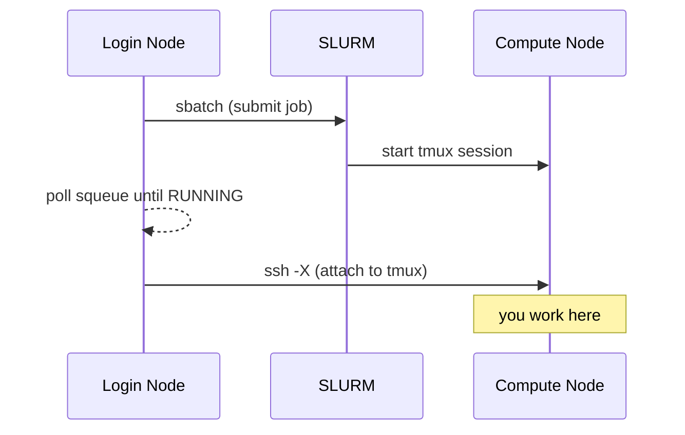

# Interactive Sessions with `sinteractive`

The `sinteractive` script launches a persistent interactive session on a compute node using tmux. It's located at [`scripts/sinteractive`](https://github.com/rnabioco/bodhi-slurm-migration/blob/main/scripts/sinteractive) in this repository.

## Why use `sinteractive` instead of `srun --pty bash`?

| | `srun --pty bash` | `sinteractive` |
|---|---|---|
| Survives SSH disconnects | No — session is lost | Yes — tmux keeps it alive |
| Multiple terminal panes | No | Yes — tmux split/window support |
| X11 forwarding | Manual setup | Automatic (`ssh -X`) |
| Reconnect to session | Not possible | `sinteractive --attach JOBID` |

!!! tip "When to use which"
    Use `srun --pty bash` for quick, throwaway interactive work. Use `sinteractive` when you need a session that persists through network interruptions or when you want tmux features like split panes.

## Installation

```bash
make install
```

This copies the script to `~/.local/bin/`. Make sure `~/.local/bin` is in your `$PATH` (add `export PATH="$HOME/.local/bin:$PATH"` to your `~/.bashrc` if needed).

To install to a different location:

```bash
make install PREFIX=~/bin
```

## Usage

```bash
sinteractive [OPTIONS] [SBATCH_ARGS...]
```

### Options

| Option | Description | Default |
|---|---|---|
| `--node NODE` | Request a specific compute node | any available |
| `--partition PART` | SLURM partition | `normal` |
| `--time TIME` | Wall time limit | `08:00:00` |
| `--attach JOBID` | Reattach to a running session | |
| `-h`, `--help` | Show help message | |

All other arguments are passed directly to `sbatch`, so you can use any `sbatch` option.

### Examples

```bash
# Default: 8-hour session on the normal partition
sinteractive

# Run on a specific node
sinteractive --node compute01

# 2-hour session on the rna partition
sinteractive --time=2:00:00 --partition=rna

# Request extra memory and CPUs
sinteractive --mem=16G --cpus-per-task=4

# GPU session
sinteractive --partition=gpu --gpus=1 --mem=16G
```

## How it works

1. **Submits a batch job** — `sbatch` launches the script itself on a compute node, where it starts a tmux session.
2. **Waits for the job to start** — polls `squeue` every 5 seconds until the job is running (you'll see dots printed while waiting).
3. **Connects via SSH** — once running, it SSHs into the compute node with X11 forwarding (`-X`) and attaches to the tmux session.
4. **Stays alive until you exit** — the SLURM job remains running as long as the tmux session exists. Detaching (`Ctrl-b d`) or losing your SSH connection leaves the job running so you can reconnect. Exiting tmux (`exit`) ends the job.



## Reconnecting after a disconnect

If your SSH connection drops or you intentionally detach (`Ctrl-b d`), the tmux session **keeps running** on the compute node and your work is safe. To reconnect from the login node:

```bash
# Find your job ID
squeue --me
#   JOBID  PARTITION  NAME          NODE       STATE
#   12345  normal     sinteractive  compute01  RUNNING

# Reattach
sinteractive --attach 12345
```

!!! info "This is the key advantage over `srun --pty bash`"
    With `srun`, a dropped SSH connection kills your session and any running processes. With `sinteractive`, you just reconnect and pick up where you left off.

## Tips

### Basic tmux commands

| Action | Key |
|---|---|
| Detach from session | `Ctrl-b d` |
| Split pane horizontally | `Ctrl-b "` |
| Split pane vertically | `Ctrl-b %` |
| Switch between panes | `Ctrl-b arrow-key` |
| Scroll up | `Ctrl-b [` then arrow keys (press `q` to exit) |

### Cancelling the job

Exiting the tmux session (type `exit` or `Ctrl-d` in all panes) automatically cancels the SLURM job. You can also cancel it directly:

```bash
scancel <JOBID>
```

!!! warning "Wall time"
    The default wall time is **8 hours**. If you need more, pass `--time` explicitly. The `normal` partition allows up to 7 days.
